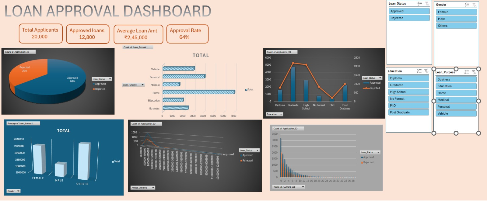

# loan-approval-dashboard
“Excel dashboard analyzing loan approval trends with KPIs, charts, and slicers.”
# Loan Approval Dashboard

## 📊 Project Overview
This project analyzes loan approval trends using a synthetic dataset.  
The dashboard was built in **Microsoft Excel** with PivotTables, KPIs, slicers, and charts.

## 📂 Repository Contents
- `dataset.csv` → Loan approval dataset (synthetic).  
- `dashboard.xlsx` → Excel dashboard file.  
- `dashboard_screenshot.png` → Screenshot of the dashboard.  
- `report.pdf` (optional) → Detailed project report.  

## ✨ Features
- KPI cards: Total Applicants, Approved Loans, Average Loan Amount, Approval Rate.  
- Interactive slicers: Loan Status, Gender, Education, Loan Purpose.  
- Charts: Pie chart, bar chart, line chart, combo chart.  
- Insights into approval trends by demographics and financial factors.

## 🚀 How to Use
1. Download `dashboard.xlsx`.  
2. Open in Excel.  
3. Use slicers to filter by Loan Status, Gender, Education, Loan Purpose.  
4. Explore KPIs and charts dynamically.

## 🛠️ Skills Demonstrated
- PivotTables & PivotCharts  
- KPI card creation  
- Dashboard design & layout  
- Data visualization & storytelling

## 📸 Dashboard Preview

